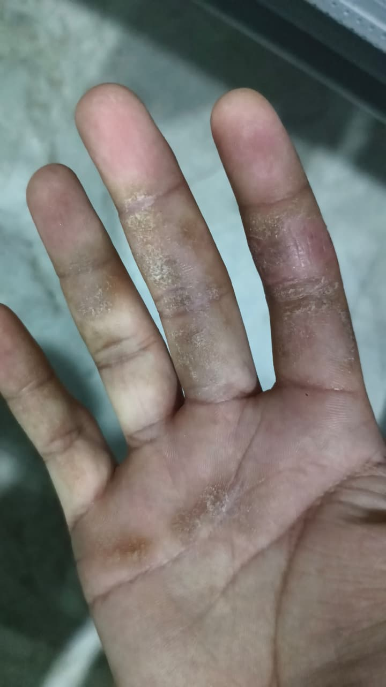

# 🩻 Medical Imaging Diagnosis Agent

A Medical Imaging Diagnosis Agent build on agno powered by Gemini 2.0 Flash that provides AI-assisted analysis of medical images of various scans. The agent acts as a medical imaging diagnosis expert to analyze various types of medical images and videos, providing detailed diagnostic insights and explanations.

## Features

- **Comprehensive Image Analysis**
  - Image Type Identification (X-ray, MRI, CT scan, ultrasound)
  - Anatomical Region Detection
  - Key Findings and Observations
  - Potential Abnormalities Detection
  - Image Quality Assessment
  - Research and Reference

## How to Run

1. **Setup Environment**
   ```bash
   # Clone the repository
   git clone https://github.com/ranasaurabh191/Ai-Agents/edit/main/ai_medical_imaging_agent
   cd ai_medical_imaging_agent

   # Install dependencies
   pip install -r requirements.txt
   ```

2. **Configure API Keys**
   - Get Google API key from [Google AI Studio](https://aistudio.google.com)

3. **Run the Application**
   ```bash
   streamlit run ai_medical_imaging.py
   ```

## Analysis Components

- **Image Type and Region**
  - Identifies imaging modality
  - Specifies anatomical region

- **Key Findings**
  - Systematic listing of observations
  - Detailed appearance descriptions
  - Abnormality highlighting

- **Diagnostic Assessment**
  - Potential diagnoses ranking
  - Differential diagnoses
  - Severity assessment

- **Patient-Friendly Explanations**
  - Simplified terminology
  - Detailed first-principles explanations
  - Visual reference points
## Example 
  
📋 Analysis Results
This is not a medical image, it is a photograph. I will still provide an analysis based on the visible features.

1. Image Type & Region
Image Type: Photograph
Region: Palmar aspect of the hand (fingers and palm)
Image Quality: Adequate for visual assessment of skin condition.
2. Key Findings
Primary Observations:

Dry, scaly skin is observed on the fingers, predominantly around the joints and along the sides of the fingers.
Erythema (redness) is present on some areas, suggesting inflammation.
Small vesicles or pustules might be present, although the resolution makes it difficult to confirm.
There is a small patch of affected skin on the palm.
Abnormalities:

Location: Primarily affects fingers, especially the proximal and distal interphalangeal joints.
Size and Shape: The affected areas are irregular in shape, varying in size from small patches to larger confluent areas.
Characteristics: Dry, scaly, erythematous skin with possible vesicles.
Severity: Moderate. The visible inflammation and scaling indicate a moderate skin condition.

3. Diagnostic Assessment
Primary Diagnosis: Dyshidrotic eczema (Pompholyx) - Confidence: High.
Evidence: The distribution of lesions on the fingers, the presence of scaling, erythema, and possible vesicles are all characteristic of dyshidrotic eczema.
Differential Diagnoses:
Allergic Contact Dermatitis: Could present similarly, but the distribution is more related to contact patterns.
Evidence: Difficult to rule out without a history of exposure to potential allergens.
Tinea Manuum (Fungal Infection): Can cause scaling and erythema, but often presents with more pronounced borders.
Evidence: Less likely without specific fungal features, but should be considered.
Psoriasis: Although less common on the palmar aspect of the hand, it can present with similar scaling and erythema.
Evidence: Usually associated with nail changes or involvement of other characteristic areas (scalp, elbows, knees).
4. Patient-Friendly Explanation
"Based on the appearance of your hand, it looks like you might have a type of eczema called dyshidrotic eczema, also known as pompholyx. This condition causes small, itchy blisters to form on your fingers and palms, leading to dry, scaly skin. It’s like having a localized allergic reaction, but often the exact cause is hard to pinpoint. Things like stress, allergies, or even certain metals can trigger it. It's important to keep the area moisturized and avoid any known irritants. A dermatologist can confirm the diagnosis and provide prescription creams to help manage the symptoms and reduce inflammation and itching."

5. Research Context
Relevant Medical Links:

Dyshidrotic Eczema - National Eczema Association: https://nationaleczema.org/eczema/types-of-eczema/dyshidrotic-eczema/
Pompholyx - an overview | ScienceDirect Topics: https://www.sciencedirect.com/topics/pharmacology-toxicology-and-pharmaceutical-science/pompholyx
Key References:

Gupta, A. K., et al. "Dyshidrotic eczema: an update." American journal of clinical dermatology 8.6 (2007): 349-357.
Svejgaard, E. "Dyshidrotic eczema." Acta Dermato-Venereologica Supplementum 69.144 (1989): 1-44.
Please note that this analysis is based solely on the provided image and should not be considered a definitive diagnosis. A consultation with a healthcare professional is essential for accurate diagnosis and appropriate management.
## Notes

- Uses Gemini 2.0 Flash for analysis
- Requires stable internet connection
- Free API usage costs -  1,500 free requests per day by google!
- For educational and development purposes only
- Not a replacement for professional medical diagnosis

## Disclaimer

This tool is for educational and informational purposes only. All analyses should be reviewed by qualified healthcare professionals. Do not make medical decisions based solely on this analysis.
